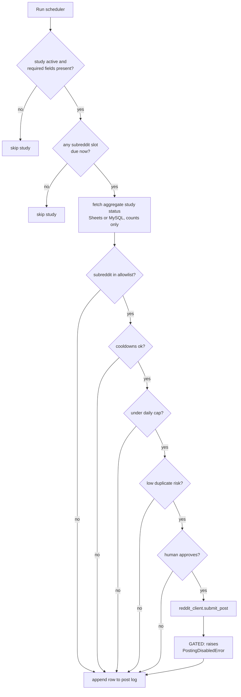

# Reddit Survey Scheduler

> **Status:** Skeleton / pre-implementation.
> Actual Reddit submission is **disabled** until Reddit Data API access is approved.
> See [`src/reddit_scheduler/reddit_client.py`](src/reddit_scheduler/reddit_client.py) — `POSTING_ENABLED = False`.
>
> **For subreddit moderators:** see [MODERATORS.md](MODERATORS.md) for opt-out instructions.

---

## Purpose

This scheduler posts survey participation posts — short self-text posts with direct links to online questionnaires — in a small, curated allowlist of survey-friendly Reddit communities, from a single dedicated account: `u/PerceptionStudies`. The initial use case is non-commercial academic and perception research.

Every post is:

- **Scheduled** in advance (specific weekday + time per subreddit, configurable).
- **Approved by a human** (operator must type `YES` and enter their name/handle) before submission.
- **Limited** by per-subreddit cooldowns, per-account gaps, duplicate-risk checks, and a daily cap.
- **Allowlisted** to specific survey-focused subreddits, with current rules manually checked before production use.
- **Tagged** with the correct subreddit flair.
- **Logged** in append-only CSV for full audit history.

The scheduler also reads aggregate response counts from our own survey backends (Google Forms / a private MySQL DB) so we can record "how many participants did this post bring in" — but it never reads any individual respondent's data, and never reads any Reddit user data.

---

## What this scheduler does



## What this scheduler does NOT do

This list is reflected in the code design: there are no implementations for voting, DMs, automated comments, user scraping, karma manipulation, or ban evasion. Reviewers can grep for any of these terms and find no calls.

- Does **not** vote, upvote, or downvote any post or comment.
- Does **not** send private messages or chat messages.
- Does **not** post automated comments or replies.
- Does **not** read or store Reddit user data. It may read subreddit-level metadata needed for posting — for example, flair templates and posting requirements — but it does not read user profiles, comments, post histories, votes, follower lists, or any other user-attributed content.
- Does **not** manipulate karma.
- Does **not** evade bans, mutes, or rate limits.
- Does **not** post to any subreddit that is not explicitly on the allowlist.
- Does **not** post without a human reviewing and approving each post first.
- Does **not** read any individual respondent's survey answers.
- Does **not** read or store any personally identifiable information from anyone.

---

## Aggregate-only data policy

Two external integrations exist, both **read-only and aggregate-only**, both gated behind feature flags:

| Source | What it reads | What it never reads |
|---|---|---|
| **Google Sheets** (Form Responses tab) | Number of submissions (length of column A minus the header row) | Any cell content, any respondent identity |
| **MySQL** (experiment table) | `COUNT(*)` total, `COUNT(*) WHERE training_termination_reason = 'completed'` | Any row contents, any participant identifier |

See [`src/reddit_scheduler/study_status.py`](src/reddit_scheduler/study_status.py) — both integrations are disabled (`SHEETS_ENABLED = False`, `MYSQL_ENABLED = False`) and return deterministic mock counts so the scheduler can run end-to-end for review without any credentials or network access.

The post log records aggregate counts at the moment of posting so we can analyze how many participants each post brings in, never tied to any Reddit user.

---

## Account, allowlist, and flair

**Posting account:** `u/PerceptionStudies` — a dedicated research account that posts only survey participation posts with direct survey links. No other use.

**Allowed subreddits** (defined in [`examples/config.example.yaml`](examples/config.example.yaml), not hardcoded):

| Subreddit | Why it's on the list | Default flair |
|---|---|---|
| r/SampleSize | Survey-focused subreddit; intended for survey posts based on current subreddit rules | Academic |
| r/TakeMySurvey | Survey-focused subreddit; intended for survey posts based on current subreddit rules | Academic |

A subreddit can only be added by editing the config file — the code refuses to post to any subreddit not on the list. Moderators can request removal at any time per [MODERATORS.md](MODERATORS.md).

**Before production use, the operator will manually verify each allowlisted subreddit's current rules and remove any subreddit that no longer permits these posts.** This re-check is part of the same manual review that prepares each post for the human approval gate.

---

## Posting schedule

Each study declares a posting plan per allowed subreddit, in a specific timezone (Eastern). The scheduler is invoked periodically (e.g., once an hour by Task Scheduler / cron) and only posts when the current time falls within a 30-minute window of a scheduled slot.

The example schedule in [`examples/config.example.yaml`](examples/config.example.yaml) is intentionally conservative: **one launch post per study per subreddit**, and the example config allows only one approved post total per day across all subreddits (`daily_post_limit: 1`).

| Day (ET) | Subreddit | Study |
|---|---|---|
| Mon 12:00 | r/SampleSize | Study A |
| Tue 12:00 | r/TakeMySurvey | Study A |
| Wed 12:00 | r/SampleSize | Study B |
| Thu 12:00 | r/TakeMySurvey | Study B |

This satisfies all the safety gates without conflict:

- The 25-hour per-subreddit cooldown passes because each subreddit gets at most one post per day.
- The 30-day duplicate-risk window passes because the same study posts to the same subreddit only once.
- The daily post limit (1) passes for the same reason.

To repost the same study after the 30-day window, the operator deliberately edits the posting plan in config — there is no automatic reposting.

Logic: [`src/reddit_scheduler/schedule.py`](src/reddit_scheduler/schedule.py).

---

## Safety checks

Each gate is a standalone pure function in [`src/reddit_scheduler/safety_checks.py`](src/reddit_scheduler/safety_checks.py). All are unit-testable in isolation:

| Function | Guard |
|---|---|
| `is_subreddit_allowed` | Allowlist enforcement |
| `is_study_active` | Study marked `active: true` |
| `missing_required_fields` | Title, URL, eligibility, contact, etc., must be present |
| `respects_subreddit_cooldown` | 25-hour minimum between posts to same subreddit |
| `respects_account_cooldown` | Per-account minimum gap between any two posts |
| `under_daily_post_limit` | Max posts per UTC calendar day across all subreddits |
| `low_duplicate_risk` | No similar post to same subreddit within lookback window |

The schedule check (see above) is a pre-gate: if no slot is due now, the study is skipped before any other gate runs.

---

## Configuration

See [`examples/config.example.yaml`](examples/config.example.yaml) for the full schema. Key settings:

```yaml
global_limits:
  daily_post_limit: 1
  per_account_min_gap_minutes: 60

per_subreddit:
  cooldown_hours: 25

allowed_subreddits:
  - SampleSize
  - TakeMySurvey

schedule_window_minutes: 30
```

---

## Post log

Every run appends rows to `post_log.csv` (gitignored). [`examples/post_log_example.csv`](examples/post_log_example.csv) shows the schema with fake data:

```
timestamp_iso, study_id, subreddit, action, reason, approver,
reddit_post_id, response_count, completion_count, data_source
```

`action` values: `skipped`, `declined_by_human`, `approved_disabled`, `posted` (last one only after API approval).

`response_count` and `completion_count` are aggregate totals from our own surveys at post time — never any Reddit data.

---

## Local dry-run

```powershell
python -m venv .venv
.\.venv\Scripts\Activate.ps1
pip install -e .
python -m reddit_scheduler --config examples/config.example.yaml --log post_log.csv
```

Behavior with everything gated:

1. The scheduler checks the schedule. If no slot is due in the current 30-minute window, it exits silently (this is correct — it just means it isn't time to post).
2. If a slot is due, it pulls mock aggregate counts from `study_status.py` (`sheets:mock` returns 123/87; `mysql:mock` returns 410/117).
3. It runs all safety gates.
4. It asks for human approval, showing a full preview including subreddit, flair, title, aggregate counts, and full body.
5. On approval, it logs `approved_disabled` and prints:
   ```
   Actual Reddit submission disabled until Reddit API approval.
   ```

No network calls to Reddit, Google Sheets, or MySQL are made.

### Tests

```powershell
pip install -e .[dev]
pytest
```

Tests cover the safety gates (allowlist, daily limit, duplicate-window, subreddit/account cooldowns, active study, required fields) and never touch the network. See [`tests/test_safety_checks.py`](tests/test_safety_checks.py).

---

## Enabling for production (after API approval)

Done in this order:

1. **Reddit API approval received** — set `POSTING_ENABLED = True` in `src/reddit_scheduler/reddit_client.py` and uncomment the praw block.
2. **Credentials configured** — copy `.env.example` to `.env` and fill in real values. `.env` is gitignored.
3. **Aggregate integrations enabled** — set `SHEETS_ENABLED = True` and/or `MYSQL_ENABLED = True` in `src/reddit_scheduler/study_status.py` and uncomment the corresponding block.
4. **Single end-to-end test** — run with one study against one subreddit with the human approval gate fully exercised before turning the schedule loose.
5. **Scheduled invocation** — register the scheduler with Windows Task Scheduler (or cron) at a frequency that lines up with the schedule window (e.g., every 15 minutes).

---

## Project layout

```
reddit-survey-scheduler-prototype/
  README.md                          (you are here)
  MODERATORS.md                      (opt-out and contact info)
  LICENSE                            (MIT)
  .gitignore                         (Python + .env + post_log.csv)
  .env.example                       (placeholder values only)
  pyproject.toml
  examples/
    config.example.yaml              (allowlist, schedule, studies)
    post_log_example.csv             (fake rows)
  src/reddit_scheduler/
    __init__.py
    __main__.py                      (CLI entry)
    config.py                        (YAML loader + validation)
    schedule.py                      (due-slot resolver, timezone-aware)
    scheduler.py                     (main flow, gates in order)
    safety_checks.py                 (guardrail functions)
    study_status.py                  (aggregate-only Sheets/MySQL stubs)
    approval.py                      (strict human YES approval prompt)
    reddit_client.py                 (gated stub)
    post_log.py                      (append-only CSV log)
  tests/
    test_safety_checks.py            (allowlist, cooldowns, daily limit, duplicate, active study)
```

---

## Contact

- **Email:** anthony.walsh@mail.mcgill.ca
- **Reddit (developer):** `u/Fair_Imagination_410`
- **Reddit (posting account):** `u/PerceptionStudies`
- **GitHub Issues:** [this repo](https://github.com/Megaboots8/reddit-survey-scheduler-prototype/issues)

For subreddit moderator opt-out: [MODERATORS.md](MODERATORS.md).

---

## License

MIT — see [LICENSE](LICENSE).
